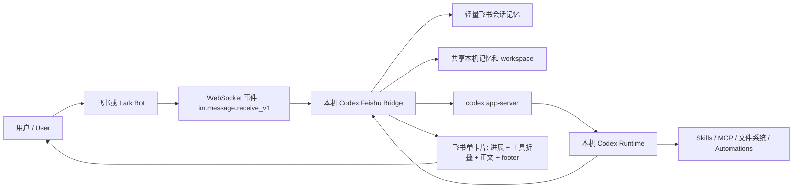
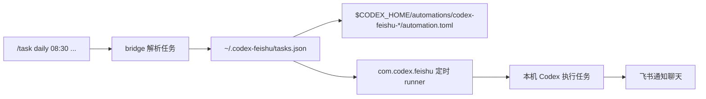
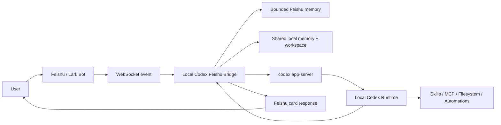

# Codex Feishu Bridge Skill

把飞书 / Lark 变成本机 Codex 的消息入口：你在飞书里发消息，真正执行任务的是你自己电脑上的 Codex CLI / Desktop 运行时。

This skill turns Feishu / Lark into a messaging front end for your local Codex runtime: messages arrive in Feishu, but the actual work is performed by Codex running on your own machine.

> 中文说明在前，English guide follows below.

## 目录

- [这个项目是什么](#这个项目是什么)
- [能实现什么效果](#能实现什么效果)
- [工作原理](#工作原理)
- [安装与启动](#安装与启动)
- [飞书侧配置](#飞书侧配置)
- [常用命令](#常用命令)
- [文件布局](#文件布局)
- [安全边界](#安全边界)
- [排障与验证](#排障与验证)
- [English Guide](#english-guide)

## 这个项目是什么

`codex-feishu-bridge-skill` 是一个可复用的 Codex skill，用来安装和维护一个本地飞书机器人桥接服务。它的核心定位不是“再做一个云端 AI bot”，而是让飞书成为本机 Codex 的轻量入口。

也就是说：

- 飞书负责接收消息、展示卡片、发送通知。
- 本地 bridge 负责维护飞书连接、会话摘要、任务调度和消息格式。
- Codex 仍然在本机运行，继续使用你的 Codex 登录状态、API 配置、skills、MCP tools、本地文件系统和自动化元数据。
- 机器人可以拥有独立于桌面 Codex 的模型 / provider 配置，但不会把真实密钥写进仓库。

适合的场景：

- 想在飞书里直接叫 Codex 查资料、改代码、操作本机项目、调用已安装 skills。
- 想把定时提醒、日报、天气、服务器巡检等任务通过飞书推送。
- 想让手机上的飞书成为本机 Codex 的远程入口，但又不想把本机权限和密钥交给第三方云服务。
- 想把 Codex 的执行过程用单张飞书卡片展示出来，而不是刷屏式消息流。

## 能实现什么效果

安装完成后，你可以在飞书 DM 或群聊中这样使用：

```text
帮我检查今天的日程和未完成任务
/model
/model fhl gpt-5.4 high
/task daily 08:30 整理今天日程和待办
/task every 30m 检查下载状态
/task weekly mon,wed@08:30 生成项目周报
/stop
/new
```

典型效果：

- **飞书像 Codex 的聊天窗口**：消息进入飞书 bot 后，会被送到本机 Codex app-server 执行。
- **单卡片输出**：每次用户消息生成一张独立飞书卡片，先展示公开执行进展，再展示最终正文。
- **过程不刷屏**：工具调用、命令、文件改动等细节保留在折叠面板里，默认不挤占正文。
- **可读的执行进展**：bridge 优先展示模型主动写出的 `执行进展：...`，看起来接近 Codex Desktop 的 commentary，而不是暴露原始命令日志。
- **本机能力可用**：Codex 仍能使用本机 skills、MCP、文件、项目目录、记忆、自动化。
- **飞书模型可独立切换**：`/model` 查看飞书侧当前 provider / model / reasoning；`/model <provider> <model> <reasoning>` 精确切换，不必跟桌面 Codex 同步。
- **支持备用模型**：可配置 `CODEX_FEISHU_FALLBACK_MODELS`，主模型遇到余额不足、额度、限流、上游 5xx、超时等可切换错误时，会自动改用备用模型重试本轮任务。
- **轻量会话记忆**：飞书对话只保留滚动摘要和最近几轮，避免长历史不断膨胀。
- **共享本地记忆**：`USER_MEMORY.md`、`CODEX_FEISHU_MEMORY.md`、`AGENTS.md` 可放稳定的非密钥上下文，例如 NAS 别名、Home Assistant 地址、偏好规则。
- **定时任务可见**：飞书创建的任务保存在 `~/.codex-feishu/tasks.json`，并镜像到 `$CODEX_HOME/automations`，Codex 也能看见。
- **通知更干净**：通知型聊天可以只收到最终正文，不带 footer、工具日志和过程区。
- **运行中可控**：运行时收到“进展如何”会快速回复状态；明确纠正会中断当前任务；普通补充消息可排队到下一轮。

## 工作原理

整体链路如下：



一次普通对话大致发生这些步骤：

1. 飞书通过 WebSocket 把 `im.message.receive_v1` 事件发给本机 bridge。
2. bridge 做去重、白名单 / mention 策略检查，并为这一次用户消息创建一张新的飞书响应卡片。
3. bridge 读取共享记忆、当前飞书会话的滚动摘要、最近几轮消息和用户输入，组合成本轮 Codex prompt。
4. bridge 调用本机 `codex app-server`，而不是直接调用 OpenAI 或第三方模型 API。
5. Codex 使用飞书专用 `codex-home` 配置，同时共享主 `$CODEX_HOME` 下的登录状态、skills、memories、sessions、plugins 和 automations。
6. 执行过程中，模型写出的 `执行进展：...` 会被抽取到飞书卡片进展区，并从最终正文中移除。
7. 命令、MCP、文件改动等工具细节进入折叠的“工具调用”面板。
8. 最终答案和运行 footer 会更新到同一张飞书卡片里。

定时任务链路：



调度器是 timer-based：

- 它会计算下一次到期任务。
- 它会睡到下一次到期时间，或睡到配置的 wake window 上限。
- `CODEX_FEISHU_TASK_POLL_SECONDS` 是兜底唤醒窗口，不代表每 N 秒执行一次任务。

## 安装与启动

### 1. 安装 skill

把 `codex-feishu-bridge/` 复制到 Codex skills 目录：

```bash
mkdir -p "$HOME/.codex/skills"
cp -R codex-feishu-bridge "$HOME/.codex/skills/"
```

之后可以让 Codex 使用 `codex-feishu-bridge` skill 来安装、验证或排障。

### 2. 安装本地 bridge

在本仓库根目录运行：

```bash
python3 codex-feishu-bridge/scripts/install_codex_feishu_bridge.py \
  --app-id FEISHU_APP_ID \
  --app-secret FEISHU_APP_SECRET \
  --notify-chat-id FEISHU_NOTIFY_CHAT_ID \
  --install-launch-agent
```

参数说明：

- `--app-id`：飞书 / Lark 自建应用的 app id，例如 `cli_...`。
- `--app-secret`：应用 secret。只写入本地 `.env`，不要提交到 GitHub。
- `--notify-chat-id`：可选，定时任务和通知默认发送到这个 chat。
- `--domain feishu|lark`：选择飞书中国版或 Lark 国际版。
- `--home`：默认安装到 `~/.codex-feishu`。
- `--codex-home`：主 Codex home，默认 `~/.codex`。
- `--feishu-codex-home`：飞书专用 Codex home，默认 `~/.codex-feishu/codex-home`。
- `--workspace`：飞书任务默认工作区，默认 `~/.codex-feishu/workspace`。
- `--allowed-users`：可选，限制允许使用 bot 的 open_id。
- `--install-launch-agent`：在 macOS 安装 `com.codex.feishu` LaunchAgent。
- `--dry-run`：只展示将要做什么，不实际写入。

### 3. 配置或检查本地 `.env`

安装器会创建：

```text
~/.codex-feishu/.env
```

也可以用交互脚本写入基础凭据：

```bash
~/.codex-feishu/app/configure.sh
```

`.env` 里只应保存本机私有配置，例如：

```bash
CODEX_FEISHU_APP_ID=FEISHU_APP_ID
CODEX_FEISHU_APP_SECRET=FEISHU_APP_SECRET
CODEX_FEISHU_DOMAIN=feishu
CODEX_FEISHU_CONNECTION_MODE=websocket
CODEX_FEISHU_NOTIFY_CHAT_ID=FEISHU_NOTIFY_CHAT_ID
CODEX_FEISHU_REQUIRE_MENTION=false
CODEX_FEISHU_FALLBACK_MODELS=deepseek|deepseek-v4-flash|medium
```

不要把 `.env`、日志、对话记忆、真实 chat id 或 token 提交到仓库。

### 4. 启动和重载 macOS 服务

如果安装了 LaunchAgent：

```bash
launchctl bootout gui/$(id -u) "$HOME/Library/LaunchAgents/com.codex.feishu.plist" 2>/dev/null || true
launchctl bootstrap gui/$(id -u) "$HOME/Library/LaunchAgents/com.codex.feishu.plist"
launchctl kickstart -k gui/$(id -u)/com.codex.feishu
```

手动检查：

```bash
~/.codex-feishu/app/start.sh --check
~/.codex-feishu/app/start.sh --connect-check --connect-check-seconds 2
launchctl print gui/$(id -u)/com.codex.feishu
```

## 飞书侧配置

在飞书 / Lark 开发者后台：

1. 创建一个自建应用。
2. 启用机器人能力。
3. 复制 app id 和 app secret 到本地 `.env` 或安装命令参数。
4. 开启事件订阅，推荐 WebSocket 模式，避免暴露公网 HTTP callback。
5. 订阅事件 `im.message.receive_v1`。
6. 可选订阅 `im.message.reaction.created_v1`、`im.message.reaction.deleted_v1`、`card.action.trigger`。
7. 给应用开通接收消息、发送消息、读取消息内容、获取 bot 基础信息等权限。
8. 发布或安装应用到租户。
9. 在群聊中使用时，把 bot 拉入群；如果不想要求 @，设置 `CODEX_FEISHU_REQUIRE_MENTION=false`。

更多细节见 [feishu_setup.md](codex-feishu-bridge/references/feishu_setup.md)。

## 常用命令

飞书聊天里：

```text
/model
/model fhl gpt-5.4 high
/model gpt-5.4 high
/task daily 08:30 整理今天日程和待办
/task every 30m 检查下载状态
/task at 2026-05-25T09:00 提醒我更新日报
/task weekly mon,wed@08:30 生成项目周报
/stop
/new
/reset
```

命令说明：

- `/model`：查看飞书侧当前 provider、model、reasoning 和可选模型。
- `/model <provider> <model> <reasoning>`：按 provider 精确切换，例如 `/model fhl gpt-5.4 high`。
- `/model <model> <reasoning>`：只有模型名在所有 provider 中不冲突时才允许省略 provider。
- `CODEX_FEISHU_FALLBACK_MODELS`：本地 `.env` 里的备用模型列表，支持逗号、分号或换行分隔，单项格式推荐 `provider|model|reasoning`，例如 `deepseek|deepseek-v4-flash|medium`。
- `/task daily HH:MM ...`：创建每日任务。
- `/task every 30m ...`：创建间隔任务。
- `/task at YYYY-MM-DDTHH:MM ...`：创建一次性任务。
- `/task weekly mon,wed@HH:MM ...`：创建每周任务。
- `/stop`：终止当前飞书聊天中正在运行的 Codex turn。
- `/new` 或 `/reset`：清空当前飞书聊天的轻量会话上下文，不删除共享记忆、skills、auth 或任务。

本机命令：

```bash
python3 codex-feishu-bridge/scripts/verify_codex_feishu_bridge.py --home "$HOME/.codex-feishu"
~/.codex-feishu/app/tasks.py list
~/.codex-feishu/app/tasks.py list --all
~/.codex-feishu/app/tasks.py pause TASK_ID
~/.codex-feishu/app/tasks.py resume TASK_ID
~/.codex-feishu/app/tasks.py delete TASK_ID
```

## 文件布局

默认安装到：

```text
$HOME/.codex-feishu/
  .env                         # 飞书凭据和本地配置，不要提交
  feishu-model.json            # 飞书侧 provider/model/reasoning 偏好
  app/
    codex_feishu_app.py        # bridge 主程序
    start.sh                   # 启动入口
    configure.sh               # 本地交互配置
    conversation_memory.py     # 飞书轻量会话记忆
    shared_memory.py           # 共享本机记忆读取
    tasks.py                   # 任务存储和 Codex automation 镜像
  codex-home/
    config.toml                # 飞书侧 Codex 配置
  conversations/               # 每个飞书会话的滚动摘要
  logs/
  runtime/
    src/                       # 打包的运行时代码
    venv/                      # Python venv
  shared-memory.md             # bridge 级共享记忆
  tasks.json                   # 飞书任务权威存储
  workspace/
    AGENTS.md
    CODEX_FEISHU_MEMORY.md
    USER_MEMORY.md
```

Codex automation 镜像：

```text
$CODEX_HOME/automations/codex-feishu-<task-id>/automation.toml
```

macOS LaunchAgent：

```text
$HOME/Library/LaunchAgents/com.codex.feishu.plist
```

## 安全边界

这个仓库应当只包含可分享的模板和代码，不应包含个人部署数据。

发布或提交前请检查：

```bash
rg -n "cli_|oc_|ou_|app_secret|tenant_access_token|authorization|sk-|ghp_|github_pat_" .
```

不要提交：

- `.env`
- 飞书 `app_secret`
- tenant / user / app access token
- OpenAI 或第三方 provider API key
- 完整飞书 chat id、open id、user id
- 私有日志、对话记录、任务库、记忆文件
- 能直接定位个人内网或服务器的敏感连接信息

bridge 本身也会对日志做脱敏处理，但不要依赖日志脱敏来保护已经被提交到仓库的秘密。

## 排障与验证

运行验证脚本：

```bash
python3 codex-feishu-bridge/scripts/verify_codex_feishu_bridge.py --home "$HOME/.codex-feishu"
```

如果飞书收不到消息：

- 确认应用已安装到租户。
- 确认订阅了 `im.message.receive_v1`。
- 确认 WebSocket 模式已启用。
- 确认没有第二个 bridge 进程使用同一组 app 凭据。
- 群聊里确认 bot 已进群，并检查是否需要 @。

如果 Codex 不回答：

- 本机运行 `codex doctor`。
- 检查 `CODEX_HOME` 和 `CODEX_FEISHU_CODEX_HOME`。
- 检查本机 `codex` 命令是否可用。
- 查看 `~/.codex-feishu/logs/launchd.err.log`。
- 运行 `~/.codex-feishu/app/start.sh --check`。

如果定时任务不可见：

- 检查 `~/.codex-feishu/tasks.json`。
- 检查 `$CODEX_HOME/automations/codex-feishu-*`。
- 确认未设置 `CODEX_FEISHU_DISABLE_CODEX_AUTOMATION_MIRROR=true`。
- 查看 bridge 日志中的任务创建或镜像错误。

更多架构说明见 [architecture.md](codex-feishu-bridge/references/architecture.md)。

---

## English Guide

`codex-feishu-bridge-skill` is a reusable Codex skill for installing and operating a local Feishu / Lark bot bridge. The bot is not a standalone cloud AI. It is a transport layer that forwards Feishu messages into your local Codex runtime.

### What It Does

- Receives Feishu / Lark bot messages through WebSocket events.
- Starts local Codex turns through `codex app-server`.
- Sends progress, tool summaries, final answers, and runtime footers back to Feishu.
- Keeps a bounded Feishu-side conversation memory so long chat history does not grow forever.
- Shares local Codex skills, MCP tools, memories, sessions, plugins, automations, and auth state from your main `$CODEX_HOME`.
- Keeps a Feishu-specific `codex-home` so the bot can use an independent provider / model / reasoning profile.
- Supports fallback models through `CODEX_FEISHU_FALLBACK_MODELS`; retryable provider failures such as insufficient balance, quota, rate limits, upstream 5xx, or timeouts can automatically switch to the next configured model for the current task.
- Mirrors Feishu-created scheduled tasks into `$CODEX_HOME/automations` for Codex visibility.
- Supports notification-only chats where scheduled output is clean final content without tool/progress/footer noise.

### User Experience

In Feishu, you can talk to the bot like a remote Codex window:

```text
Check my agenda and unfinished tasks for today
/model
/model fhl gpt-5.4 high
/task daily 08:30 summarize today's agenda and todos
/task every 30m check download status
/task weekly mon,wed@08:30 create a project report
/stop
/new
```

Each inbound user turn gets its own Feishu response card. The card normally shows:

- public execution progress first;
- a collapsed tool-call panel with concise command/tool/file-change summaries;
- the final answer;
- an optional compact runtime footer.

The bridge prefers model-authored public progress lines such as:

```text
执行进展：I am checking the local schedule source first, then I will summarize conflicts.
```

Those lines are displayed in the progress area and stripped from the final answer. Raw shell commands, local paths, JSON payloads, and large tool outputs stay out of the visible progress area.

### Architecture



The important design choice: the bridge does not call model-provider APIs directly. Codex owns model access, account/API login, skills, tools, and local filesystem permissions. Feishu is only the interface.

### Install the Skill

Copy the skill into your Codex skills directory:

```bash
mkdir -p "$HOME/.codex/skills"
cp -R codex-feishu-bridge "$HOME/.codex/skills/"
```

Then ask Codex to use the `codex-feishu-bridge` skill.

### Install the Local Bridge

From the repository root:

```bash
python3 codex-feishu-bridge/scripts/install_codex_feishu_bridge.py \
  --app-id FEISHU_APP_ID \
  --app-secret FEISHU_APP_SECRET \
  --notify-chat-id FEISHU_NOTIFY_CHAT_ID \
  --install-launch-agent
```

Useful options:

- `--domain feishu|lark`: choose Feishu China or Lark international.
- `--home`: installation home, default `~/.codex-feishu`.
- `--codex-home`: main Codex home, default `~/.codex`.
- `--feishu-codex-home`: Feishu-specific Codex home, default `~/.codex-feishu/codex-home`.
- `--workspace`: default workspace for Feishu turns.
- `--allowed-users`: optional open_id allowlist.
- `--install-launch-agent`: install the macOS LaunchAgent.
- `--dry-run`: show planned changes without writing files.

### Feishu / Lark App Setup

In the Feishu / Lark developer console:

1. Create a custom app.
2. Enable bot capability.
3. Copy the app id and app secret into the local installer or `.env`.
4. Enable event subscription. WebSocket mode is recommended because it avoids a public HTTP callback URL.
5. Subscribe to `im.message.receive_v1`.
6. Optionally subscribe to `im.message.reaction.created_v1`, `im.message.reaction.deleted_v1`, and `card.action.trigger`.
7. Grant practical bot permissions: receive messages, send messages, read message content, and read basic bot info.
8. Publish or install the app into your tenant.
9. For group chats, invite the bot and configure mention requirements with `CODEX_FEISHU_REQUIRE_MENTION`.

### Commands

Feishu chat commands:

```text
/model
/model <provider> <model> <reasoning>
/model <model> <reasoning>
/task daily HH:MM <prompt>
/task every 30m <prompt>
/task at YYYY-MM-DDTHH:MM <prompt>
/task weekly mon,wed@HH:MM <prompt>
/stop
/new
/reset
```

Fallback models are configured locally in `.env`:

```bash
CODEX_FEISHU_FALLBACK_MODELS=deepseek|deepseek-v4-flash|medium
```

Use comma, semicolon, or newline separators for multiple candidates. Each item can use `provider|model|reasoning`, `provider/model/reasoning`, or the same free-form syntax accepted by `/model`.

Local verification and task management:

```bash
python3 codex-feishu-bridge/scripts/verify_codex_feishu_bridge.py --home "$HOME/.codex-feishu"
~/.codex-feishu/app/start.sh --check
~/.codex-feishu/app/tasks.py list --all
~/.codex-feishu/app/tasks.py pause TASK_ID
~/.codex-feishu/app/tasks.py resume TASK_ID
~/.codex-feishu/app/tasks.py delete TASK_ID
```

### Local File Layout

Default install:

```text
$HOME/.codex-feishu/
  .env
  feishu-model.json
  app/
  codex-home/
  conversations/
  logs/
  runtime/
  shared-memory.md
  tasks.json
  workspace/
```

Automation mirrors:

```text
$CODEX_HOME/automations/codex-feishu-<task-id>/automation.toml
```

macOS service:

```text
$HOME/Library/LaunchAgents/com.codex.feishu.plist
```

### Security

Never commit:

- `.env`
- Feishu `app_secret`
- tenant/user/app access tokens
- OpenAI or model-provider API keys
- full private chat IDs or open IDs
- logs, conversations, task stores, or local memory files

Before publishing, scan for secrets:

```bash
rg -n "cli_|oc_|ou_|app_secret|tenant_access_token|authorization|sk-|ghp_|github_pat_" .
```

### Troubleshooting

Run:

```bash
python3 codex-feishu-bridge/scripts/verify_codex_feishu_bridge.py --home "$HOME/.codex-feishu"
```

If the bot does not receive messages, confirm app installation, `im.message.receive_v1`, WebSocket mode, group mention policy, and that no second bridge process is using the same app credentials.

If Codex does not answer, run `codex doctor`, check the `codex` binary, inspect `CODEX_HOME`, and review `~/.codex-feishu/logs/launchd.err.log`.

For deeper implementation notes, see [architecture.md](codex-feishu-bridge/references/architecture.md) and [feishu_setup.md](codex-feishu-bridge/references/feishu_setup.md).
